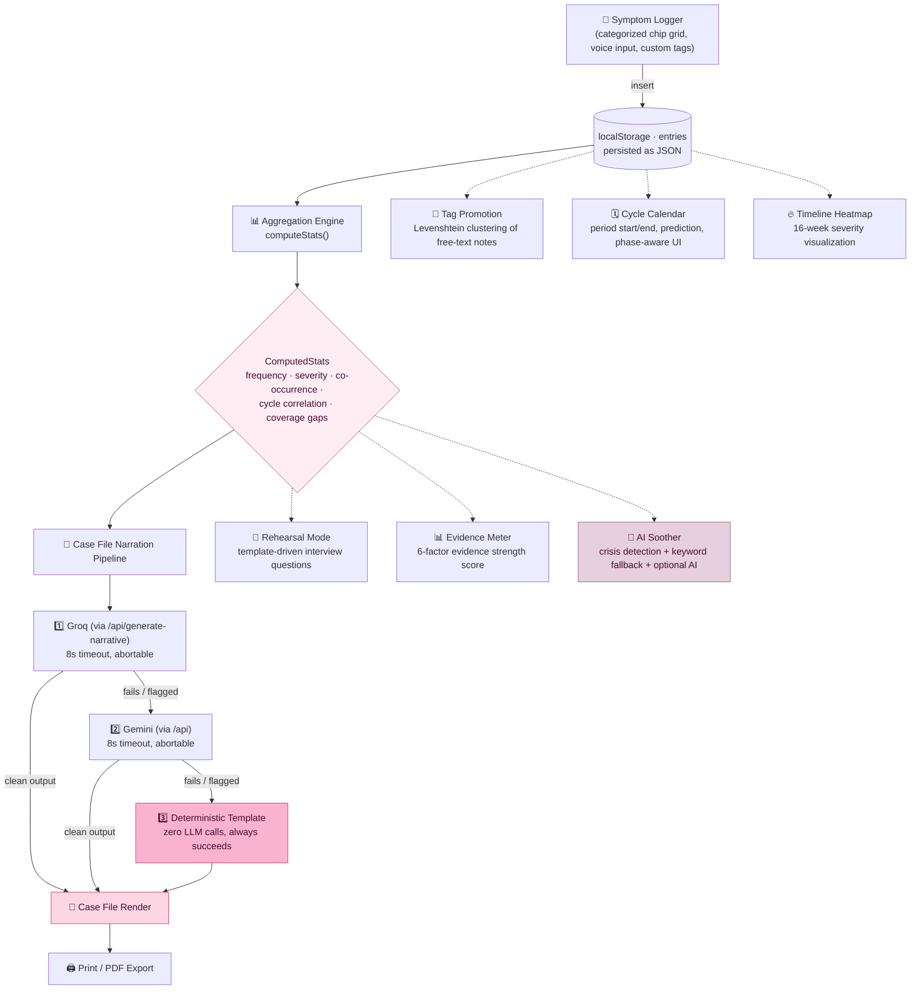

<div align="center">

# 🕊️ Undismissed

### *Your symptoms, compiled. Not dismissed.*

**A symptom-documentation companion that turns scattered self-reports into a clinical, doctor-ready Case File — built for the HerWellness track at Vibe2Vision 2026.**

[](https://react.dev)
[](https://www.typescriptlang.org)
[](https://vitejs.dev)
[](https://tailwindcss.com)
[](https://www.framer.com/motion/)
[]()


</div>

<br/>

> **In-app the product wears the name *HerWellness* — the persona built for this track.** Across planning docs and this repo it's referred to by its working title, **Undismissed**. Same app, two names, one thesis.

<br/>

## 📋 Table of Contents

- [The Problem](#-the-problem)
- [What It Does](#-what-it-does)
- [How It Works](#-how-it-works)
- [The Core Principle](#-the-core-principle)
- [Features at a Glance](#-features-at-a-glance)
  - [📝 Symptom Logging](#-symptom-logging)
  - [🏠 Home Dashboard](#-home-dashboard)
  - [📄 Case File](#-case-file)
  - [🤖 AI Soother](#-ai-soother)
  - [🎯 Rehearsal & Advocacy Coach](#-rehearsal--advocacy-coach)
  - [🔄 Follow-up Ledger](#-follow-up-ledger)
  - [📊 Timeline & Insights](#-timeline--insights)
  - [🗓️ Cycle Tracking](#️-cycle-tracking)
  - [🏷️ Tag Promotion](#️-tag-promotion)
- [Tech Stack](#-tech-stack)
- [Design Language](#-design-language)
- [Project Structure](#-project-structure)
- [Data Model](#-data-model)
- [Safety & Guardrails](#-safety--guardrails)
- [Getting Started](#-getting-started)
- [Environment Variables](#-environment-variables)
- [Available Scripts](#-available-scripts)
- [Current Status & Known Limitations](#-current-status--known-limitations)
- [Roadmap](#-roadmap)
- [FAQ](#-faq)
- [Disclaimer](#-disclaimer)

<br/>

## 🩸 The Problem

There's typically a multi-year gap between when symptoms start and when they're actually diagnosed — and along the way, most people see several doctors before anyone takes the pattern seriously. Not because the symptoms weren't real, but because "it's been happening for a while" and "it feels worse sometimes" are memory, not evidence. A doctor working a fifteen-minute slot has no way to separate real signal from recall bias in real time.

**Undismissed doesn't try to change how a doctor listens.** It makes sure what a patient brings into the room can't be waved off as anecdote, mood, or stress — because it isn't one. It's a record.

<br/>

## 🌸 What It Does

<table>
<tr>
<td width="25%" valign="top">

### 🩷 Log
Fast, low-friction symptom logging grouped by category (Pain, Energy & Mind, Digestive, Physical Changes, Mood). Tap a chip, adjust severity on a 1–5 stepper (pre-set to Moderate), optionally log a cycle day, or use voice input. Free-text "other" entries get fuzzy-matched over time and offered for promotion into a trackable custom tag.

</td>
<td width="25%" valign="top">

### 📄 Case File
One tap turns raw entries into a clinical-register narrative: frequency, average severity, co-occurring symptom pairs, coverage gaps — every claim traceable to a number, nothing invented. Print-ready via `@media print`, dated and stamped like a real document. Paired with a **Follow-up Ledger** that tracks what was mentioned to a doctor and how it was received.

</td>
<td width="25%" valign="top">

### 🤖 AI Soother
A warm, pressure-free check-in space that never diagnoses. Crisis detection (`kill myself`, `want to die` etc.) surfaces India-specific helplines (iCall, KIRAN). Keyword-matched empathetic fallback replies cover 12+ emotional states. Optionally backed by an AI provider for richer conversation, with a hard 8-second abort timeout. Sessions persist to `sessionStorage` — close and reopen without losing the thread.

</td>
<td width="25%" valign="top">

### 🎯 Rehearsal & Advocacy
**Rehearsal Mode** turns a patient's *own* logged patterns into template-driven interview questions ahead of the appointment. **Advocacy Coach** ("Round Two") activates when follow-up records show a symptom was previously dismissed — it plays out the pushback the patient *actually received*, not a generic script, and offers to draft a printable advocacy note. Nothing is saved or sent anywhere.

</td>
</tr>
</table>

<br/>

## 🔧 How It Works



Nothing renders straight from raw entries. Everything the patient sees — the narrative, the evidence score, the practice questions, the advocacy note — is derived from the same `ComputedStats` object, so no two surfaces can ever contradict each other.

<br/>

## 🎯 The Core Principle

> **The LLM only narrates code-computed statistics. It never freehands a pattern from raw entries.**

This single rule is what separates the product from "a chatbot with a symptom form" — and it's also the backbone of every safety decision in the pipeline:

- A keyword net (`diagnosed with`, `indicates`, `i recommend`, `prescri…`, and friends) scans every model output before it reaches the screen.
- Free text — the `other` tag's note field, voice-transcript fallbacks — is passed to the model strictly as a **data value inside a JSON object**, never concatenated into instruction text, and the system prompt tells the model explicitly to treat it as reported data, *never* as a command, no matter what it reads like.
- If both LLM providers fail or get flagged, a fully deterministic, non-AI template — built from the exact same stats object — takes over. The user never sees an error screen, and they never see unverified prose.

> **+ AI Soother principle:** The soother is a *companion space*, not a diagnostic tool. Crisis detection is keyword-based, not ML-inferred. Fallback replies are hand-written for 12+ emotional states. AI augmentation is optional and sandboxed behind a clear disclaimer: *"This is not therapy, diagnosis, or medical advice."*

> **+ Advocacy principle:** The Advocacy Coach only activates when a patient has *already* logged a follow-up record showing a symptom was previously dismissed. It never presumes. Every practice conversation is ephemeral — nothing is saved to storage, nothing is sent to any server.

<br/>

## 🌟 Features at a Glance

### 📝 Symptom Logging

| Feature | Description |
|---|---|
| **Categorized chip grid** | Symptoms grouped into Pain, Energy & Mind, Digestive, Physical Changes, Mood — tap to select, no scroll-and-search |
| **1–5 severity stepper** | Pre-set to Moderate (3) so nobody has to make a precision judgment while symptomatic |
| **Cycle day attachment** | Optional per-entry cycle day to unlock menstrual-phase correlations |
| **Voice input** | Web Speech API (`SpeechRecognition` / `webkitSpeechRecognition`), feature-detected, degrades gracefully |
| **Free-text "other"** | Catch-all bucket with auto-clustering via Levenshtein distance for tag promotion |
| **Custom tags** | Promote repeated free-text entries into permanent trackable tags (e.g. "jaw tightness" → `custom_jaw_tightness`) |
| **Undo** | 6-second undo window on every quick-log entry |
| **Quick Log Card** | One-tap logging from the Home screen — your most-used tags always appear first |

### 🏠 Home Dashboard

The central landing after onboarding. Shows:
- **Text-reveal greeting** — time-aware ("Good morning", "Winding down?")
- **Quick Log Card** — one-tap symptom entry with undo toast
- **Stats Strip** — entries this week, current streak, estimated cycle day
- **Evidence Meter** — radial gauge with 6-factor breakdown (volume, consistency, diversity, severity detail, cycle correlation, time span)
- **Insight Teaser** — top 2 computed patterns at a glance
- **AI Assistant** — optional Groq-powered pattern analysis (when API key is configured)
- **Recent entries** — last 4 logs with inline delete
- **Case File CTA** — ready prompt when ≥3 entries logged

### 📄 Case File

- **Narration pipeline:** Groq → Gemini → Deterministic template (3-tier fallback, zero error screens)
- **Loading states:** Petal loader with rotation through 5 status messages
- **Follow-up Ledger** inline: "Have you mentioned this to a doctor before?" — logs outcome (dismissed / tested / treated / no follow-up)
- **Past Case Files** section: browse and re-view previously generated reports
- **Print / PDF:** Dedicated `@media print` styles produce a clean white document
- **Download:** JSON export from Settings panel

### 🤖 AI Soother

- **Crisis detection:** 10 keyword patterns → India helpline cards (iCall 9152987821, KIRAN 1800-599-0019)
- **Mood chips:** 5 pre-written starters ("achy today", "feeling anxious", etc.)
- **Keyword fallback:** 14 hand-written empathetic replies covering cramps, bloating, fatigue, anxiety, sadness, irritability, dismissal trauma, loneliness, overwhelm, insomnia, gratitude, and greetings
- **Session persistence:** `sessionStorage` — survive page refresh within a tab
- **Optional AI backend:** POST to `/api/ai-soother` with last 12 messages, 8-second abort timeout
- **Disclaimer always visible:** "A warm space to check in. This is not therapy, diagnosis, or medical advice."

### 🎯 Rehearsal & Advocacy Coach

**Rehearsal Mode:**
- Template-driven interview questions derived from the patient's *own* `ComputedStats`
- Voice-to-text spoken answers (Web Speech API)
- Timer per question for pressure simulation
- Completely offline-capable — no AI dependency

**Advocacy Coach ("Round Two"):**
- Only renders when follow-up records show a previously dismissed symptom
- Dropdown selector for multiple past dismissals
- **Advocacy Chat:** Role-play the actual clinic conversation with an AI-powered clinician persona (8-turn limit, ephemeral)
- **Advocacy Note:** Draft a printable 3–5 sentence note with specific data references (Groq → deterministic template fallback)

### 🔄 Follow-up Ledger

- Logged directly on the generated Case File
- Record whether a symptom was mentioned to a doctor before
- Track outcomes: **Dismissed** / **Tested** (normal/inconclusive) / **Treated** (issue continued) / **No follow-up**
- Free-text note for what the doctor said
- History view in the ledger itself
- Powers the Advocacy Coach activation logic

### 📊 Timeline & Insights

**Timeline Heatmap:**
- 16-week GitHub-style severity heatmap
- Phase-aware color overlays (cycle day → menstrual/follicular/ovulation/luteal tint)
- Interactive tooltips with tag breakdown, severity, and cycle day
- Weekday labels and month markers

**Insights Page:**
- Most-logged symptom card
- Co-occurrence pair card
- Severity trend card (rising / falling / steady)
- **AI Health Advisor** section: optional Gemini API key for forecasting, remedies, and clinical flags
- Animated loading states with rotating status messages
- Markdown rendering for AI-generated reports

### 🗓️ Cycle Tracking

**Cycle Calendar:**
- Month grid with period start/end marking
- Current period indicator, predicted next period
- Severity dots on non-period days

**Cycle Ambient Background:**
- Canvas-rendered organic ink-bleed art that shifts color with cycle phase
- 5-phase palette: Menstrual (deep rose), Follicular (bright rose), Ovulation (vibrant), Luteal (plum), Neutral
- Smooth CSS transitions between phases

**Cycle Constellation:**
- SVG visualization of entries mapped by cycle day
- Phase-colored dots with age-based opacity fade

### 🏷️ Tag Promotion

- Clusters repeated "other" free-text notes via Levenshtein distance (max distance 2)
- Minimum cluster size of 3 before prompting
- "You've described 'jaw tightness' 3 times — add it as a tag?" pill
- Added tags get a `custom_` prefix and appear alongside built-in tags in the logger and all surfaces

<br/>

## 🛠 Tech Stack

| Layer | Choice | Why |
|---|---|---|
| Framework | **React 18** + **TypeScript** | Strict typing across the `ComputedStats` contract shared by aggregation, narration, and render |
| Build tool | **Vite 5** | Fast dev loop, needed for iterating on UI polish under a hackathon clock |
| Styling | **Tailwind CSS 3** | Custom `rose` / `blush` / `plum` / `cream` palette, full custom keyframe animation set |
| Animation | **Framer Motion 11** | Page transitions, staggered entrances, layout animations on cards and nav |
| Icons | **lucide-react** + **Material Symbols Outlined** | Consistent icon system across the whole UI |
| Persistence | **localStorage** (via `lib/storage.ts`) | Zero-dependency, zero-setup persistence — every hook is localStorage-backed |
| Session | **sessionStorage** | AI Soother chat sessions don't survive tab close, which is intentional for privacy |
| AI — primary | **Groq** (via `/api/generate-narrative` proxy) | Fast enough to comfortably clear an 8s narration budget |
| AI — fallback | **Google Gemini** | Second independent provider so a single vendor outage never breaks the core loop |
| AI — safety net | **Deterministic template narrator** (`aggregation.ts`) | Zero-dependency, always-succeeds final fallback, hand-tuned against real seed data |
| AI Soother | **Keyword match** (`sootherFallback.ts`) + optional `/api/ai-soother` | Crisis detection is keyword-based, never ML; hand-written replies cover 14 emotional states |
| Voice | **Web Speech API** | No extra dependency; feature-detected, degrades to manual entry everywhere it isn't supported |
| Export | `window.print()` + dedicated `@media print` styles + JSON download | Guaranteed fallback that doesn't depend on a PDF library shipping correctly under time pressure |

<br/>

## 🎨 Design Language

The interface is built to read as a **clinical record, not an investigation corkboard** — warm and human where the patient is doing the work, restrained and document-like where the doctor eventually reads it.

**Palette**

<p>


</p>
<p>


</p>

**Type** — [Instrument Serif](https://fonts.google.com/specimen/Instrument+Serif) for display headings (warm, editorial serif), [Plus Jakarta Sans](https://fonts.google.com/specimen/Plus+Jakarta+Sans) for body text (clean, modern, unintimidating), [Reenie Beanie](https://fonts.google.com/specimen/Reenie+Beanie) for hand-lettered accent text.

**Motion** — a full custom keyframe set (`heartbeat`, `bloom`, `sway`, `twinkle`, `rise-fade`, `shimmer`, `glow-pulse`, `breathe`, `gentleFloat`, `textRevealWord`, `textBlurIn`, `textRevealLetter`) used sparingly: word-by-word entrance on the home greeting, staggered card entries, and a `ShaderBackground` + `CycleAmbientBackground` ink-bleed canvas pair that phase-shifts with the user's cycle — giving the app a quiet ambient life without competing with the data.

**Surfaces** — glassmorphic panels (`backdrop-filter: blur(24px) saturate(180%)`) for interactive surfaces, `gradient-border-animated` for the Quick Log Card (animated border sweep), flattening to flat white "printed page" register the moment `@media print` takes over.

**Ambient layer** — a `BotanicalLayer` of SVG wildflowers, ferns, chamomile, vines, and bent grass with subtle parallax mouse tracking and gentle CSS sway animations, tinted to match the rose palette.

<br/>

## 📁 Project Structure

```
undismissed/
├── scripts/
│   └── seed-demo.mjs            # seeds demo data into Supabase (legacy)
├── public/
│   └── og-image.svg             # Open Graph preview image
├── src/
│   ├── components/
│   │   ├── AdvocacyChat.tsx      # role-play clinic conversation (ephemeral)
│   │   ├── AdvocacyCoach.tsx     # "Round Two" — activates on past dismissals
│   │   ├── AdvocacyNote.tsx      # printable advocacy note draft
│   │   ├── AIAssistant.tsx       # Groq-powered pattern analysis on Home
│   │   ├── AISoother.tsx         # emotional check-in with crisis detection
│   │   ├── AppointmentPrompt.tsx # next-appointment countdown
│   │   ├── AskHelper.tsx         # compatibility wrapper → AISoother
│   │   ├── BotanicalLayer.tsx    # SVG flora with parallax + sway
│   │   ├── BottomNav.tsx         # mobile tab bar (Home / Track / Timeline / Case File / Practice)
│   │   ├── CaseFile.tsx          # narrative generation + render + print
│   │   ├── CaseFileHistory.tsx   # past Case Files list
│   │   ├── ComfortSuggestions.tsx# tag-matched self-care ideas with try tracking
│   │   ├── CycleAmbientBackground.tsx  # canvas ink-bleed phase art
│   │   ├── CycleCalendar.tsx     # period logging grid with prediction
│   │   ├── CycleConstellation.tsx# SVG entry → cycle-day map
│   │   ├── EmptyStateIllustration.tsx  # seedling / dormant-bud / open-journal SVGs
│   │   ├── EntryHistory.tsx      # recent entries (legacy wrapper)
│   │   ├── EntryRow.tsx          # single entry display row
│   │   ├── ErrorBoundary.tsx     # React error boundary
│   │   ├── EvidenceMeter.tsx     # radial gauge + 6-factor breakdown
│   │   ├── FollowupLedger.tsx    # "Mentioned before?" form + history
│   │   ├── Home.tsx              # consolidated home dashboard
│   │   ├── Icon.tsx              # Material Symbols wrapper
│   │   ├── InsightCard.tsx       # animated insight card
│   │   ├── Insights.tsx          # full insights page + AI Health Advisor
│   │   ├── InsightTeaser.tsx     # top-2 teaser for Home
│   │   ├── JourneyLogger.tsx     # categorized symptom logger
│   │   ├── JourneyRail.tsx       # 7-stage journey navigation bar
│   │   ├── LandingPage.tsx       # hero + feature cards + footer
│   │   ├── OnboardingFlow.tsx    # 3-step intro (privacy, cycle length, preview)
│   │   ├── ParticleField.tsx     # floating particle layer
│   │   ├── PetalLoader.tsx       # SVG blooming flower spinner
│   │   ├── QuickLogCard.tsx      # one-tap symptom chip + undo toast
│   │   ├── RehearsalMode.tsx     # appointment practice with voice answers
│   │   ├── Settings.tsx          # slide-over settings panel
│   │   ├── ShaderBackground.tsx  # canvas ambient background
│   │   ├── StatsStrip.tsx        # weekly entries / streak / cycle day
│   │   ├── SymptomLogger.tsx     # full categorized logger (legacy, superseded by JourneyLogger)
│   │   ├── TagPromotionSuggestion.tsx  # "add as tag?" prompt
│   │   ├── TextReveal.tsx        # word-by-word entrance animation
│   │   ├── Timeline.tsx          # raw entry timeline (legacy)
│   │   └── TimelineHeatmap.tsx   # 16-week severity heatmap
│   ├── hooks/
│   │   ├── useAISoother.ts       # soother session (sessionStorage)
│   │   ├── useCustomTags.ts      # custom tag CRUD (localStorage)
│   │   ├── useEntries.tsx        # entry CRUD (localStorage)
│   │   ├── useFollowups.ts       # follow-up ledger CRUD (localStorage)
│   │   ├── useJourney.ts         # journey stage (localStorage)
│   │   ├── usePatternReports.ts  # pattern report CRUD (localStorage)
│   │   ├── usePeriodLog.ts       # period log CRUD + prediction (localStorage)
│   │   ├── useStageTransition.ts # View Transitions API wrapper
│   │   └── useUserSettings.ts    # user settings (localStorage)
│   ├── lib/
│   │   ├── advocacyChat.ts       # API call for advocacy practice
│   │   ├── advocacyContext.ts    # ComputedStats → human-readable context
│   │   ├── advocacyNote.ts       # Groq → template advocacy note generator
│   │   ├── aggregation.ts        # computeStats(), deterministicNarrative(), computeStreak(), computeSeverityTrend()
│   │   ├── aiStatus.ts           # AI provider availability tracker
│   │   ├── comfortSuggestions.ts # tag → self-care suggestion map
│   │   ├── crisisDetection.ts    # keyword crisis detection + helpline response
│   │   ├── cyclePhase.ts         # cycle phase enum, detection, theme colors
│   │   ├── evidenceScore.ts      # 6-factor evidence strength computation
│   │   ├── fuzzyMatch.ts         # Levenshtein distance + tag promotion clustering
│   │   ├── gemini.ts             # Gemini API integration (disabled client-side)
│   │   ├── groq.ts               # Groq API integration (disabled client-side)
│   │   ├── insights.ts           # doctorFlags() + fallbackSuggestions()
│   │   ├── localFlags.ts         # localStorage flag utilities
│   │   ├── narration.ts          # generateNarrative() Groq → Gemini → template
│   │   ├── sootherFallback.ts    # 14 hand-written keyword-match replies
│   │   ├── storage.ts            # generic localStorage CRUD utilities
│   │   ├── suggestions.ts        # AI → fallback suggestion generator
│   │   ├── tagLabels.ts          # tag label resolution + custom tag prefix
│   │   └── types.ts              # TagEntry, Entry, ComputedStats, PatternReport, etc.
│   ├── types/
│   │   └── speech-recognition.d.ts  # Web Speech API type declarations
│   ├── App.tsx                   # root: landing → journey shell
│   ├── index.css                 # Tailwind + glass + gradient + print + animation styles
│   ├── main.tsx                  # render root
│   └── vite-env.d.ts
├── index.html
├── package.json
├── tailwind.config.js            # palette, fonts, keyframes, shadows
├── vite.config.ts
├── postcss.config.js
├── tsconfig.json
├── tsconfig.app.json
├── tsconfig.node.json
└── pnpm-workspace.yaml
```

<br/>

## 🗃 Data Model

```mermaid
erDiagram
    ENTRIES {
        string id UUID
        string user_id "local"
        TagEntry[] tags "[{tag, severity, note?}]"
        int cycle_day "nullable"
        timestamptz created_at
    }
    PATTERN_REPORTS {
        string id UUID
        string user_id "local"
        ComputedStats computed_stats
        string narrative
        string provider "groq | gemini | template"
        timestamptz generated_at
    }
    VISIT_FOLLOWUPS {
        string id UUID
        string user_id "local"
        string pattern_report_id "nullable"
        boolean mentioned_before
        FollowupOutcome outcome "dismissed | tested | treated | no_follow_up"
        string outcome_note
        string visit_date "nullable"
        string related_tag "nullable"
        timestamptz created_at
    }
    CUSTOM_TAGS {
        string id UUID
        string user_id "local"
        string label "e.g. Jaw Tightness"
        string source_note "original free-text"
        timestamptz created_at
    }
    PERIOD_LOGS {
        string id UUID
        string start_date
        string end_date "nullable"
        timestamptz created_at
    }
    ENTRIES ||--o{ PATTERN_REPORTS : "aggregated into"
    PATTERN_REPORTS ||--o{ VISIT_FOLLOWUPS : "linked to"
```

**`ComputedStats`** — the single interface both the aggregation engine and the narration prompt import, so nobody improvises a shape mid-pipeline:

```ts
interface ComputedStats {
  entry_count: number;
  date_range: { start: string; end: string };
  tag_frequency: { tag: string; count: number }[];           // 'other' excluded from ranking
  severity_by_tag: { tag: string; avg_severity: number; n: number; low_confidence?: boolean }[];
  co_occurrence: { tag_a: string; tag_b: string; lag_days_avg: number; n: number; low_confidence?: boolean }[];
  cycle_day_correlation?: { tag: string; avg_cycle_day: number; n: number }[];
  coverage_gap_flag?: boolean;   // true if any gap between entries exceeds 14 days
  other_notes?: string[];        // free-text 'other' entries — data only, never instructions
}
```

Any stat backed by fewer than 3 data points is marked `low_confidence` and gets hedged (or omitted) rather than stated as fact — the app would rather say less than say something confidently wrong.

<br/>

## 🛡 Safety & Guardrails

| Concern | Mitigation |
|---|---|
| **Hallucinated patterns** | Narration only ever describes fields already present in `ComputedStats` — the model has no access to raw entries |
| **Thin-sample overconfidence** | `n < 3` → `low_confidence: true`, enforced in aggregation code, not left to the model's judgment |
| **Diagnostic language** | An 11-rule system prompt bans diagnostic/prescriptive phrasing; a keyword net double-checks every output before render |
| **Prompt injection via free text** | `other`-tag notes and voice-transcript fallbacks are passed as a JSON data field, never interpolated into instruction text; the model is told explicitly to treat all of it as patient-reported data, regardless of what it appears to say |
| **`other`-bucket distortion** | The catch-all `other` tag is excluded from top-pattern ranking so ten different free-text symptoms never masquerade as "your most common symptom" |
| **Provider outage** | Two independent LLM providers, each on an abortable 8-second timeout, backed by a template narrator that needs no network call at all |
| **Malformed render data** | Loading state cycles through multiple status lines + a petal blossom spinner instead of freezing; generation is wrapped so a failure anywhere in the chain still resolves to *something* on screen |
| **Crisis detection** | Keyword-based, not ML-inferred — 10 suicide/self-harm phrases matched against input before any AI call; India-specific helpline cards surfaced inline |
| **AI Soother safety** | No therapy/diagnosis claims; disclaimer always visible; hand-written keyword fallback covers 14 emotional states without any AI dependency; `sessionStorage` means conversation dies with the tab |
| **Advocacy practice privacy** | Advocacy Chat conversations are entirely ephemeral — never saved to `localStorage`, never sent to any server except the AI provider the user explicitly configured |

<br/>

## 🚀 Getting Started

**Prerequisites:** Node 18+, npm/pnpm.

This build runs entirely on `localStorage` — no database, no server, no Supabase project needed. AI features (narration, soother, suggestions) require a backend proxy at `/api/` routes; without one, all features degrade gracefully to their deterministic fallbacks.

```bash
# 1. Clone and enter the project
git clone <your-repo-url>
cd undismissed

# 2. Install dependencies
npm install

# 3. (Optional) Configure API keys
cp .env.example .env.local   # see table below

# 4. Run the dev server
npm run dev
```

The app boots into a 3-step onboarding flow (privacy notice → optional cycle length → Case File preview), then lands on the Home dashboard. Start logging under **Track** to see the full loop.

<br/>

## 🔑 Environment Variables

> These are optional. The app runs fully on deterministic fallbacks without any keys configured.

| Variable | Required | Purpose |
|---|---|---|
| `VITE_GROQ_API_KEY` | Optional | Enables the primary narration provider (Groq `mixtral-8x7b-32768`) — currently disabled client-side for security; use a `/api/` proxy instead |
| `VITE_GEMINI_API_KEY` | Optional | Enables the Gemini fallback narration provider — currently disabled client-side for security; use a `/api/` proxy instead |
| `VITE_FORCE_TEMPLATE` | Optional | Set to `true` to force every generation through the deterministic template — useful for rehearsing the guaranteed-success path without burning API quota |

> **Security note:** The `groq.ts` and `gemini.ts` lib files both have their direct-call functions deliberately throwing errors (`throw new Error('Direct browser AI calls are disabled.')`). All AI requests are expected to go through a backend proxy at `/api/` routes. The Settings panel shows API key status but reads from `VITE_GROQ_API_KEY` for display only.

<br/>

## 📜 Available Scripts

| Command | Does |
|---|---|
| `npm run dev` | Start the Vite dev server with HMR |
| `npm run build` | Type-check and produce a production build |
| `npm run preview` | Serve the production build locally |
| `npm run lint` | Run ESLint across the project |
| `npm run typecheck` | Run `tsc --noEmit` against `tsconfig.app.json` |

<br/>

## ⚠️ Current Status & Known Limitations

This build is a **fully local-first, zero-infrastructure prototype** — every hook writes to `localStorage`, the app needs no database, and all AI features are optional. The following are honest pre-production notes:

- [ ] **Move LLM calls server-side.** The app architecture expects `/api/` proxies for narration, soother, and suggestions. No proxy currently ships with this repo — you'll need to wire one (or set `VITE_FORCE_TEMPLATE=true` to run entirely deterministically).
- [ ] **Sync across devices.** LocalStorage is single-device by nature. A real deployment would back entries to a server (the old Supabase schema is in the commit history).
- [ ] **Re-verify model IDs before relying on them long-term.** LLM model names get deprecated on their own schedule — reconfirm both providers' current model list before a real event.
- [ ] **Clinician-reviewed symptom taxonomy.** The current 15-tag list is team-curated, not medically validated.
- [ ] **Add a compliance line for health-data handling.** Anonymous-by-design and localStorage-only is a reasonable MVP posture; a real look at India's DPDP Act (and GDPR, for any international users) is an honest pre-launch item.
- [ ] **Offline-capable logging.** The app works offline because it's localStorage-based, but lacks a PWA/service-worker manifest for installability and explicit offline messaging.

None of this blocks a demo. All of it matters before real patient data touches a production schema.

<br/>

## 🗺 Roadmap

- Backend proxy for `/api/` routes (narration, soother, suggestions, advocacy)
- Account linking for real cross-device sync (anonymous, single-session is the deliberate zero-friction MVP tradeoff)
- Clinician-reviewed symptom taxonomy (the current 15-tag list is team-curated, not medically validated)
- A native mobile app — the actual use case is reaching for a phone mid-symptom
- LLM-backed follow-up questions in Practice mode, layered on top of the current template-only version
- PWA / service worker for installability and explicit offline support

<br/>

## ❓ FAQ

<details>
<summary><strong>What happens if I switch devices — do I lose my data?</strong></summary>
<br/>
Yes — anonymous, single-device by design (localStorage), which keeps the barrier to logging at zero. Account linking for cross-device sync is the next thing on the roadmap.
</details>

<details>
<summary><strong>Couldn't the AI hallucinate a pattern that isn't real?</strong></summary>
<br/>
It only narrates code-computed stats, never freehands from raw entries. A minimum-sample-size rule enforced in code, a keyword-check safety net, and a fully deterministic non-AI fallback all exist specifically to catch this.
</details>

<details>
<summary><strong>What does the AI Soother do with my messages?</strong></summary>
<br/>
Nothing. Conversations live in `sessionStorage` and die when you close the tab. If the optional AI backend is configured, the last 12 messages are sent to generate a reply — no messages are stored server-side.
</details>

<details>
<summary><strong>Is the symptom tag list medically validated?</strong></summary>
<br/>
No — it's team-curated based on common symptom-tracking practice. Clinician review is an explicit next step.
</details>

<details>
<summary><strong>What stops someone from typing something malicious into the free-text field?</strong></summary>
<br/>
Free text is only ever passed to the model as a clearly delimited data field inside the stats object, never as instruction text, and the system prompt explicitly tells the model to treat all input as reported data — never a command — regardless of content.
</details>

<details>
<summary><strong>What if a doctor doesn't trust an AI-written summary?</strong></summary>
<br/>
Every number in it traces directly to something the patient logged. It's a compiled record, not an AI opinion — and if every provider fails, the template narrator produces the same kind of summary with zero AI involvement at all.
</details>

<details>
<summary><strong>Does the app need an internet connection?</strong></summary>
<br/>
Core functionality (logging, Case File generation via template, Rehearsal Mode, Evidence Meter, Cycle Calendar) works entirely offline. Only AI features (narration via Groq/Gemini, AI Soother, AI Assistant) need a network connection.
</details>

<details>
<summary><strong>How is the Advocacy Coach different from Rehearsal Mode?</strong></summary>
<br/>
Rehearsal Mode simulates the *appointment itself* — it generates practice questions from your stats and lets you voice-answer them. Advocacy Coach activates *after* a dismissal has been logged and helps you prepare a specific pushback response with a data-backed printable note.
</details>

<br/>

## 🩺 Disclaimer

> [!WARNING]
> **Undismissed / HerWellness is a symptom documentation tool. It does not diagnose, treat, or replace medical advice or professional judgment.** Every generated summary is computed exclusively from what the user logged and is explicitly non-diagnostic by design. **The AI Soother is an emotional check-in space, not therapy, not a crisis hotline, not a substitute for professional mental health care.** If you're in crisis, please reach out to a qualified professional or a local helpline (in India: iCall at 9152987821 or KIRAN at 1800-599-0019). Always consult a qualified healthcare provider for medical decisions. This is a hackathon prototype, not a certified medical device.

<br/>

---

<div align="center">

*"I walked in with three pages of data. For the first time, my doctor didn't say 'let's wait and see.' She said 'let's look at this together.'"*

Built with 🩷 for the **HerWellness** track, Vibe2Vision 2026.

</div>
